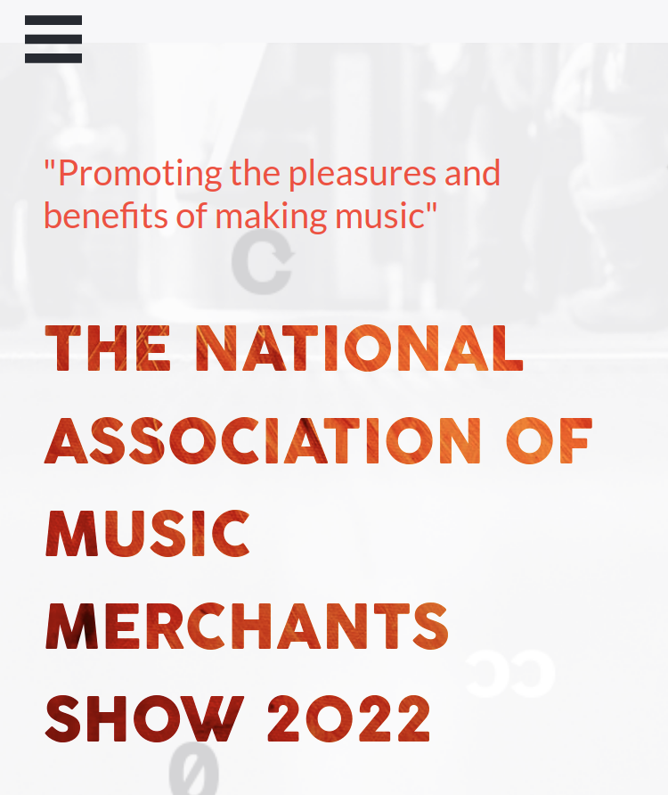
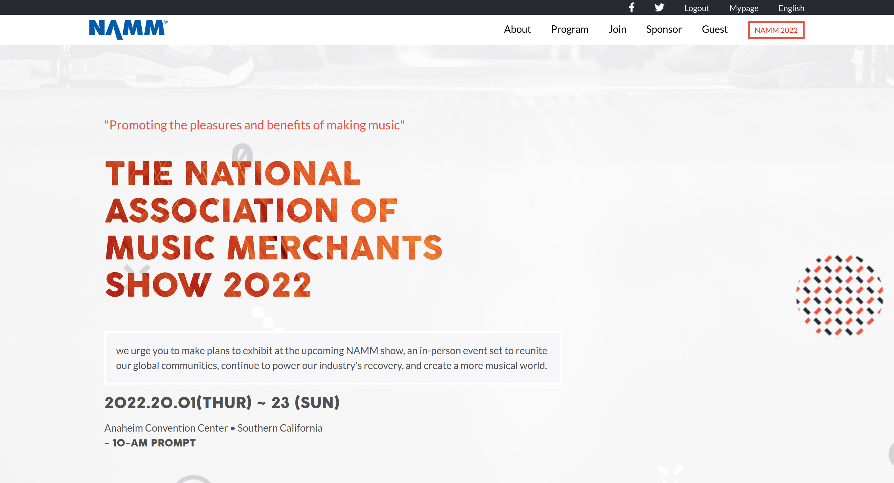

# html-css-js-capstone-project

This is my final project for HTML & CSS MODULE from the microverse curriculum

  

  

This project is meant to test student ability's on being able to put together all that they have learnt in a module to ensure they mastered it well.

## Built With

- HTML
- CSS
- JAVASCRIPT

Here's a [video ](https://www.loom.com/share/a8e3d9716fa44728be4a7f19a5444ab9) of me giving a few description of the project.

## Live Demo

[Live Demo Link](https://zieeco.github.io/html-css-js-capstone/)

## Getting Started

To get a local copy up and running:

1. Clone this repository or download the Zip folder:

**``git clone https://github.com/zieeco/html-css-javascript-capstone.git``**

2. Navigate to the location of the folder in your machine:

**``you@your-Pc-name:~$ cd <folder>``**

## Author

👤 **Isaac Samuel**

- Github: [@zieeco](https://github.com/zieeco)

- LinkedIn: [Isaac Imaobong Samuel](https://www.linkedin.com/in/isaac-imaobong-samuel-a4849b1b8/)

## Credits

- The original design ideal by [Cindy Shin in Behance](https://www.behance.net/adagio07) from [Microverse](https://bit.ly/MicroverseTN)
- Images inspired by this [All avatar images](https://pravatar.cc/images)

## Contributing

Contributions, issues, and feature requests are welcome!

## Show your support

Give a ⭐️ if you like this project and how we manage to build it!

## 📝 License

This project is [MIT](./MIT.md) licensed
